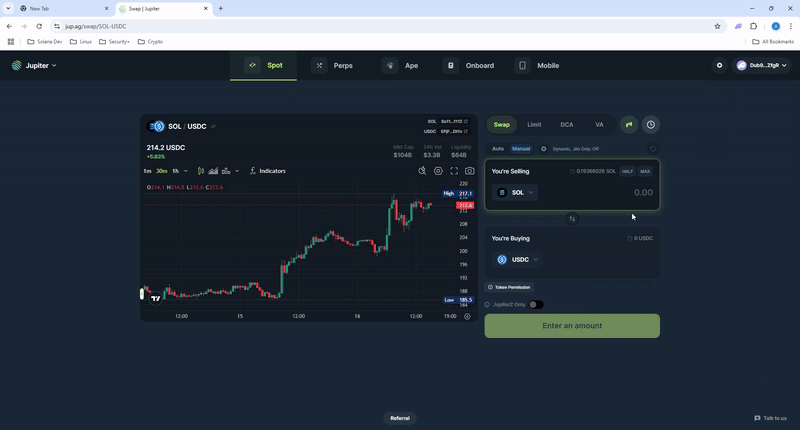

# Solana Blockchain Transaction Tracker

A Node.js project demonstrating real-time blockchain transaction tracking and processing using WebSocket subscriptions and RPC calls. This code processes transactions into human readable transactions if the wallet uses PumpFun, Raydium, or Jupiter. These are the main three platforms used in the Solana ecosystem. Transactions outside of these are labeled Unkown with the signature. 

## Overview

This project processes blockchain transactions for platforms like **Pump.fun**, **Raydium**, and **Jupiter**, providing categorized transaction summaries and detailed decoding.

### Key Features
- Real-time tracking of wallet activities using WebSocket.
- Categorization and processing of transactions into relevant groups.
- Detailed decoding of transaction data for analysis.
- Error handling for reconnections and retries.

### Highlights
- **WebSocket Integration:** Establish and manage WebSocket connections to track blockchain logs in real-time.
- **Blockchain Expertise:** Decode and categorize transactions from the Solana blockchain.
- **Error Handling:** Implement reconnection logic and robust error handling for API calls.
- **Data Processing:** Extract meaningful insights from raw blockchain data.

## Code Structure
Here's a brief look at the project's main components:

- **`Main.mjs`**: Manages WebSocket connections, transaction categorization, and processing pipelines.
- **`Pumpfun.mjs`**: Decodes and formats transactions related to Pump.fun.
- **`Raydium.mjs`**: Processes and categorizes Raydium transactions.
- **`Jupiter.mjs`**: Handles transaction decoding and categorization for Jupiter.
- **`idl_pumpfun.json`**: Defines the interface for Pump.fun-related operations.

### Example Functionality

- **Real-Time Logs:**
  ```plaintext
  WebSocket for test1 (AxHrZRSv4VmvTy3pg36FKcU7eopvCDWSq8j6gGrKE5e1) established.
  Received signature: <signature> for test1 (AxHrZRSv4VmvTy3pg36FKcU7eopvCDWSq8j6gGrKE5e1)
  Raydium
  Swapped 1.23 SOL (So11111111111111111111111111111111111111112) for 265.23 USDC (EPjFWdd5AufqSSqeM2qN1xzybapC8G4wEGGkZwyTDt1v)


## Challenges and Future Improvements

### Challenges
One of the most significant challenges was decoding transactions from various platforms. The process was complex due to:
- **Limited publicly available documentation.**
- **Sparse explanations of IDLs** (Interface Definition Language files).
- **Uncertainty about platform accessibility:** Not all platforms like open source and even if they do the documentation is very minimal causing deeper research.

Overcoming these obstacles required extensive research and experimentation, which helped deepen my understanding of blockchain transaction structures.

### Future Improvements
This project has significant potential for further enhancement, depending on the time and resources invested. Key areas for improvement include:
- **Platform Expansion:** Extend support for transaction decoding to additional platforms within the ecosystem.
- **Implementation:** With a little bit of tweaking you can run this on a cloud setup and link it to discord or telegram to have it running at all times and have transaction notifications on your mobile device.
- **Optimization:** Refine the current decoding processes to handle edge cases and improve performance.
- **Analytics and Visualization:** Integrate tools for analytics and visualization to provide user-friendly insights into transaction data.

While the initial focus was on the three most commonly used platforms for trading, future work could broaden the scope to encompass niche or emerging platforms.

## Demo GIF


